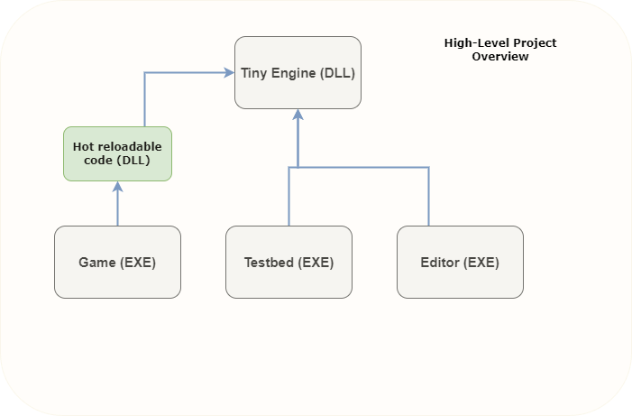
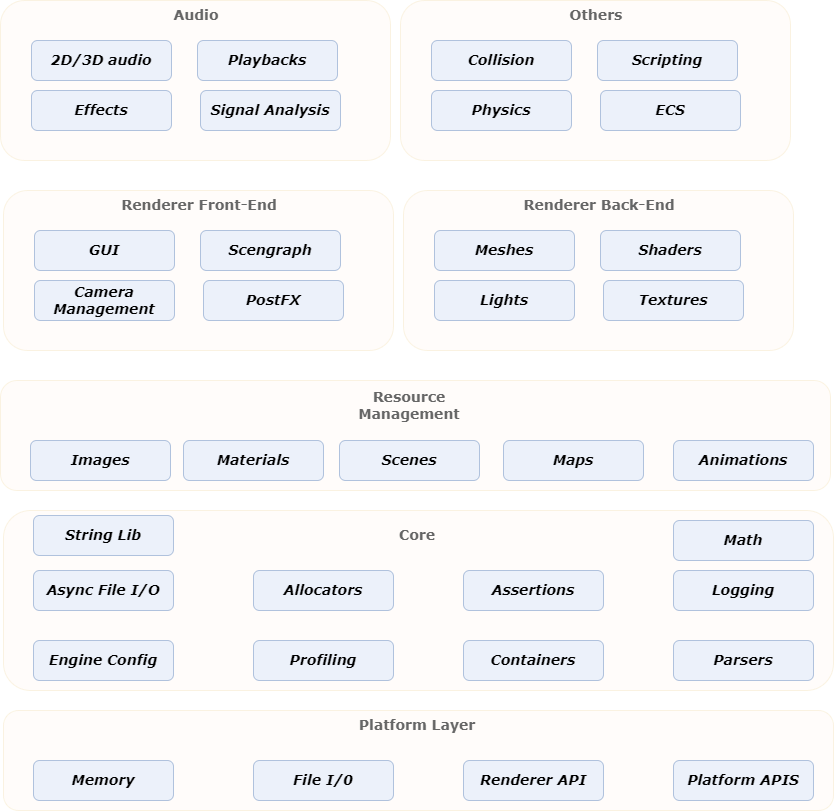
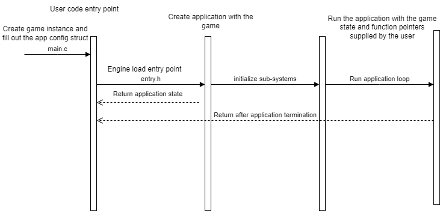
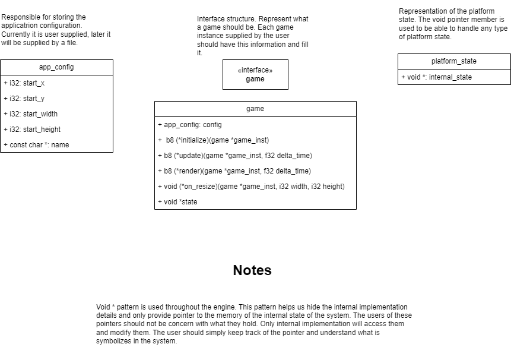

# Engine notes
In this document I will outline basic notes on the engine development process.
This is a learning experience for me and hopefully for the users of this repository.
The idea of the engine is to be implemented in vulkan. I am using various tutorials
and sources on google to troubleshoot any errors. I am writing in in C for various reasons.

1. I am very familiar with the language and also with C++. I am developing a simpler engine version
in parallel in C++. For me the engine desing process and graphics rendering is not that much of an issue,
however, time and time again I feel the complexity of C++ gets to me. Maybe it is because I am not that
proficient, maybe it's because I feel the need to use complex feature, but I wanted to make an engine
with a simpler language. For me C is more intuitive.
2. Premake as build system. I am using premake since it abstracts away the complications of build systems like
make, cmake, etc. For me the build system should be simple. I do not want it to get in the way of development. I think
the build process and pipeline should be simple to setup and use. This is why I chose premake5.

# Basic Design Idea
The engine itself should be a shared library. This design choice stems from
the fact that the engine might grow, it might have multiple plugins, systems,
might link to many libraries and I do not want to client to need to link
to all of these systems. This makes the design more modular and simple to manage.
On top of the engine we will build a few applications. The first one is the Editor
itself. Think about the editor as th unreal editor or unity editor. This is what this
application should do. It should provide interface for easy interaction with the engine.
The second applciation should be the Testbed. This is meant as an internal testing application
responsible for testing engine state and new features. Finally it is the game application
this is the actual game that the user can build and run. This application should be an exe,
but when developing within the engine we should make sure we have dll portion for hot reloading code.





// TODO: Insert graph

## Engine Part 1 (Of god knows how many)
1. Setup build system with premake. Make sure engine is dll and create the appropriate postbuildcommands.
2. Setup different environments: DEBUG,RELEASE,DIST
3. Link to Vulkan Libraries (Note those should be downloaded by the user, I will setup some scripts in the future to do that)
4. Enable exporting and importing of symbols from engine
I created a macro which allows for us to easily export and import based on if we are building the dll or not.
5. Create a logger
The current logger has 6 operational levels. Only ERROR and FATAL cannot be switched off, the rest can be switched
with preprocessor directives.
6. Create assertion system
The assertion system allows for various different types of asserts. Most importantly it provides a way
to place a breakpoint at the point of the assert and also output useful information such as file and line number.
Assert are also enabled and disabled via preprocessor directive. The idea is that we can opt to not have them,
or lets say only have DEBUG type of asserts.
7. The testbed
The testbed links to the engine and can use it's functionality via its exported symbols.
8. Typedefs
For me writing unsigned char, unsigned long long, is a waist of time. I created a defines.h which basically
shortness the type definitions. Basically we only care about the size of the type and what the type is. Is it
integral, floating, boolean type.

Some interesting stuff I learned while doing this:
```C
	va_list arg_ptr;
	va_start(arg_ptr,msg);
```
I knew in C there we variadic arguments to macros, but I did not know how to work
with variadic arguments to functions. So yeah that was knew + the function `vsnprintf(buffer,size,msg,arg_ptr(va_list))`.
This function formats arguments into a buffer which is basically a string. The msg parameter is the string format we need
the buffer is the place where we will store them.

I will try to include some diagrams of the current logger design as well as assertion design.

## Engine Part 2
We now need to start building the platform layer of the system. This layer should handle platform
specific operations, such as windowing (if applicable to the system), allocation, threads, etc.
Since each platform has different representation of internal state we can encapsulate the state
via a platform state structure which holds a void pointer to intern state. In each of the
platform source files we will define internal state struct only to be used internally.
```C
 typedef struct platform_state{
	void *internal_state;
 } platform_state;
```
In each platform file we will provide the implementation between an #ifdef and #endif block. The idea
behiind this is to use conditional compilation, since the logic needed to run on windows will not be
needed if we run on playstation for example. The most important functions in the platform layer will
be: b8 platform_startup, and platform_shutdown. These function should instantiate the window and anything
needed by the platform. The shutdown will clean up all the resources. In the windows platform case,
after we create a window we will need to handle events that come into the window. This will be done 
using the windows native callback mechanism. I will outline some important properties and processes
to follow when creating and managin a window.

1. Handles - Windows and many othe roperating system operate using handles, we need to obtain the handle
of the window so that we can reference it and perform operations on it
2. Window size - Each window has a total size, however if we want 1024 by 768 we want this to be the client
size of the window, not the total window including the title bar and everything else. Thus we need to calculate
this by using the AdjustWindowEx function of the windows api.
3. Window styles - using the windows api we can apply style to the window. Some important ones are

```C
	WS_CAPTION,
	WS_OVERLAPPED,
	WS_SYSMENY,
	WS_THICKFRAME,
	WS_THINFRAME,
	WS_MAXIMIZE,
	WS_MINIMIZE,
```
4. Handle window messages - This is done using the LRESULT CALLBACK win32_process_message(HWND hwnd, u32 msg, WPARAM w_param, LPARAM l_param);
function. This is a window provided function that we can redefine to implement our own callbacks. Some important thing about
callbacks. On some events we want to say to the OS that we will handle the event thus we need to return a specific code to indicate that.
Those are events like closing, or redrawing the window. For the rest we simply query that parameters and call our own functions to handle
the events. For some events that are not of our interest we can simply call DefWindowProcA pass in the parameters and windows will handle
the event for us.
5. Clock - We want to be able to query the absolute time. In order to do that we need 2 things mainly. The lcok frequency, and the clocks that have passed.
Then we can obtain the 64 bit number and perform basic math to obtain the time.
6. Writing to STD_OUT and STD_ERROR. We can color our log input levels in windows. This could be done via windows api.
We need to get the handle to the STD_OUT or ERROR. Using the GetStdHandle(STD_OUT_HANDLE); and then set
the color of the text based on some value like: FOREGROUND_BLUE, using SetConsoleTextAttribute(handle,color);

Again I will try to include some preliminary design graphs of the platform layers. I will focus on the data structures
and the control flow if any exists currently.


## Engine Part 3
The goal for this part is to abstract the entry point. The user should only supply configuration
of the application along with his game and that's it. The engine should be responsible for 
running the game. So how will this be achieved. We need to define a header file in the engine
called entry.h. There we will tell the compiler that we have b8 extern create_game function. This
function will be defined and created by the user. In the entry.h file we will have a main function
which will call the create game function, to create a game. Then it will create an application,
and finally run the application with the game. But what is a game? What is application? What interfaces
does a game provide.

1. Application - We need to configuration for now: width, height, start_x, start_y, name, platform_state
2. Game - game_state (void *), function pointers for, creation, rendering, updating, window resizing, application config

How does everything flow? Let's see what the user needs to do know. He needs to fill out the application config struct
of his game, which is basically, width, height, name etc. He then needs to provide the function pointers for his game's
render, initialize, update, and resize. This is it. Then the game will use this function to create the game according
to the user specifications. It will then create an application with this game, and run the application. The application
run method will poll and handle events from the window. It will also update and render the game using the function
pointers provided by the user. The reason that we leave the engine to handle the game is the following. The engine
can be responsible for logging and handling errors of reporting failures to the user. We do not want the user
to need to handle these things.


I will again place design graphs. These will be a little higher level control flow graphs that expose the
control flow from the start to the end of the application. This will show which part is user code, and which
is delegated to the engine. I will also try to provide basic graphs of the design of the data structures and
how they flow throughout the code.





## Engine Part 4
In this part we will design the basic memory allocation structure and tagging system. We will also go and design
the event system. Why do we need custom memory system in the first place? Well first of all it will be more efficient
to have a custom memory system since we might want to create a big block of memory and use it inside the engine rather
than many small allocations. Second we can create custom memory routines.

### Memory system
For now the most important part will be to be able to track the memory usage throughout the engine. Whenever we allocate
memory we want to classify it into an enum type. Later we can use the memory statistic to output how much memory the system
uses for different things. This can be helpful to both the engine programmer and the player that creates his game. The allocation,
free, etc is quite easy. We just tag a block add its size to the memory_stats struct and proceeed to allocate the block
with our predefined platform layer allocation. This will be the case for all of the functions. Since memory allocation
si very important and one of the lower level sub-systems we will intialize it before anything in the entry.h file. This
will most likely be the only system that will get initialized then. 
#### Logging trouble
Since we create the logger in create_application function, right now we might miss some logs at system level. However, this
is fine. If we really need to see what is happenign we can move the log to entry and initialize it after memory.


### Event system
Why do we need events? If you look at any popular game engine like Unreal or Unity (I specifically like Unreal even system), they
have event systems. Event provide us a useful mechanism to communicate between object and react to events, rather than perform
busy waiting. The basics of event system are the following. We need event types, the even structure itself and we need an efficient
callback mechanism. Where we can assign a callback in case an event of some type fires. This system will be used in various level
of the engine so we have to make sure it is robust. For example we can use it to process user input on window level, like resizing,
keyboard etc. We can also use it at later stage for the ECS components. I will provide a graph of the basic idea behind the event system.
Currently the event will be ran instantaniously, in the future they will be queue for processing later and probably run on a separate
thread.


#### Event system data structures
One question is first of all what is na event? Who sends events? How listens to events? How to add callbacks?
Well first an event is some context, some data that is being sent from one place to another. Data is typically
small, thus the event being lightwieght. We do not want to store huge amount of data, rather just notify that
something happened and store the crucial information. For that we will use a union of data. The union can store
128 bytes of various formats. Thats it for the `event context` itself. Next is the callback. Well let's treat
a callback like an interface function that the `listener` should implement. What should this function be?
We need:

1. The code of the event (some sort of enum)
2. The event context (data of the event)
3. The sender (void *)
4. The listener (void *)

We can now define a typedef like:
```C
 typedef b8 (*PFN_on_event)(u16 code, void *sender, void *listener_inst, event_context data);
```
Okay but how to efficiently store these events and codes. For the codes we define the following convention.
One enum for engine codes (from 0 to 255) and one for user code (256  to whatever). Okay then each code
will be commented with it's use (how to use the data in the data context and where it will be stored).
Okay now how to store all the events with all the listeners and callbacks.

```C
	struct registered_event{
		void *listener;
		PFN_on_event cb;
	}

	struct event_code_entry{
	registered_event *events;
	}

	struct event_system_state{
		event_code_entry entries[MAX_CODES];
	};
```
 With this structure we can easily store array of event codes along with their
 listeners and callback functions. Now we need an interface for the event system.
 We need to be able to do the following things:

 1. initialize the system - allocate memory for the system state
 2. shutdown the system - deallocate the system state
 3. register listener for a specific event code with a callback function
 4. deregister listener from a specific event
 5. fire an event to all the listeners of it.

### Containers
We will need to use a lot dynamic arrays. In C it is not easy to create something like vector but we will try.
Of course it will not be type-checked like in C++, and it will use macro magic. How to do it.
Well since the data inside the block of memory is of unknow type we need a `void *` to a block of memory.
In order to insert into it we need to know to size of the elements or namely the `stride`. I will not explain
in detail here but rather provide diagrams. The basic idea is the following. Allocate a block of memory
and store the information about the array as a header in the first 192 bits `3 integers of size u64 stride,length,capacity`.
The rest of the space is the actual array. We will hide the header from the user and only pass to him the actual
array space without the header so basically `((void *)(array + 3 * sizeof(u64)))`. We will cerate functions
to interact with the array that will be `hidden` i say hidden since yes they will be exported but the user should
not interact with them, rather with macros we have defined. Then for each function we define a public macro
that will access the function and perform potentially more things to format and fix the passed data.
Whenever we insert, resize, or pop we will fix the header information of the array. This will be done
by offsetting the start of the array by minus `3 * sizeof(u64)`. This information ios crucial
since when we want to deallocate the array we need actually know the capacity and stride of the array.
Otherwise we will leak memory.

TODO: provide graphs on array

