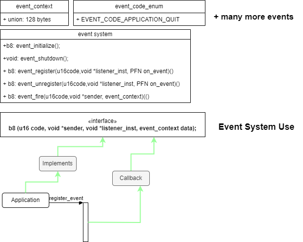
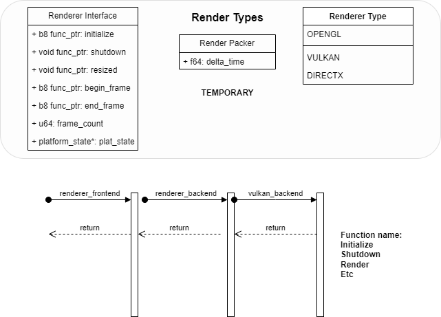
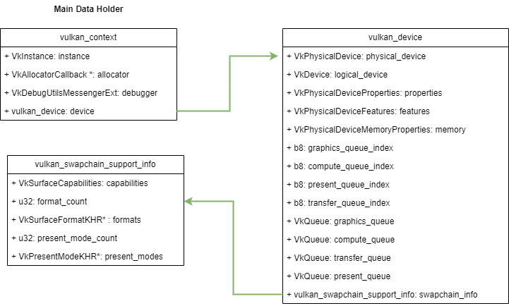

# Engine notes
In this document I will outline basic notes on the engine development process.
This is a learning experience for me and hopefully for the users of this repository.
The idea of the engine is to be implemented in vulkan. I am using various tutorials
and sources on google to troubleshoot any errors. I am writing in in C for various reasons.

1. I am very familiar with the language and also with C++. I am developing a simpler engine version
in parallel in C++. For me the engine desing process and graphics rendering is not that much of an issue,
however, time and time again I feel the complexity of C++ gets to me. Maybe it is because I am not that
proficient, maybe it's because I feel the need to use complex feature, but I wanted to make an engine
with a simpler language. For me C is more intuitive.
2. Premake as build system. I am using premake since it abstracts away the complications of build systems like
make, cmake, etc. For me the build system should be simple. I do not want it to get in the way of development. I think
the build process and pipeline should be simple to setup and use. This is why I chose premake5.

# Basic Design Idea
The engine itself should be a shared library. This design choice stems from
the fact that the engine might grow, it might have multiple plugins, systems,
might link to many libraries and I do not want to client to need to link
to all of these systems. This makes the design more modular and simple to manage.
On top of the engine we will build a few applications. The first one is the Editor
itself. Think about the editor as th unreal editor or unity editor. This is what this
application should do. It should provide interface for easy interaction with the engine.
The second applciation should be the Testbed. This is meant as an internal testing application
responsible for testing engine state and new features. Finally it is the game application
this is the actual game that the user can build and run. This application should be an exe,
but when developing within the engine we should make sure we have dll portion for hot reloading code.


// TODO: Insert graph

## Engine Part 1 (Of god knows how many)
1. Setup build system with premake. Make sure engine is dll and create the appropriate postbuildcommands.
2. Setup different environments: DEBUG,RELEASE,DIST
3. Link to Vulkan Libraries (Note those should be downloaded by the user, I will setup some scripts in the future to do that)
4. Enable exporting and importing of symbols from engine
I created a macro which allows for us to easily export and import based on if we are building the dll or not.
5. Create a logger
The current logger has 6 operational levels. Only ERROR and FATAL cannot be switched off, the rest can be switched
with preprocessor directives.
6. Create assertion system
The assertion system allows for various different types of asserts. Most importantly it provides a way
to place a breakpoint at the point of the assert and also output useful information such as file and line number.
Assert are also enabled and disabled via preprocessor directive. The idea is that we can opt to not have them,
or lets say only have DEBUG type of asserts.
7. The testbed
The testbed links to the engine and can use it's functionality via its exported symbols.
8. Typedefs
For me writing unsigned char, unsigned long long, is a waist of time. I created a defines.h which basically
shortness the type definitions. Basically we only care about the size of the type and what the type is. Is it
integral, floating, boolean type.

Some interesting stuff I learned while doing this:
```C
	va_list arg_ptr;
	va_start(arg_ptr,msg);
```
I knew in C there we variadic arguments to macros, but I did not know how to work
with variadic arguments to functions. So yeah that was knew + the function `vsnprintf(buffer,size,msg,arg_ptr(va_list))`.
This function formats arguments into a buffer which is basically a string. The msg parameter is the string format we need
the buffer is the place where we will store them.

I will try to include some diagrams of the current logger design as well as assertion design.

## Engine Part 2
We now need to start building the platform layer of the system. This layer should handle platform
specific operations, such as windowing (if applicable to the system), allocation, threads, etc.
Since each platform has different representation of internal state we can encapsulate the state
via a platform state structure which holds a void pointer to intern state. In each of the
platform source files we will define internal state struct only to be used internally.
```C
 typedef struct platform_state{
	void *internal_state;
 } platform_state;
```
In each platform file we will provide the implementation between an #ifdef and #endif block. The idea
behiind this is to use conditional compilation, since the logic needed to run on windows will not be
needed if we run on playstation for example. The most important functions in the platform layer will
be: b8 platform_startup, and platform_shutdown. These function should instantiate the window and anything
needed by the platform. The shutdown will clean up all the resources. In the windows platform case,
after we create a window we will need to handle events that come into the window. This will be done 
using the windows native callback mechanism. I will outline some important properties and processes
to follow when creating and managin a window.

1. Handles - Windows and many othe roperating system operate using handles, we need to obtain the handle
of the window so that we can reference it and perform operations on it
2. Window size - Each window has a total size, however if we want 1024 by 768 we want this to be the client
size of the window, not the total window including the title bar and everything else. Thus we need to calculate
this by using the AdjustWindowEx function of the windows api.
3. Window styles - using the windows api we can apply style to the window. Some important ones are

```C
	WS_CAPTION,
	WS_OVERLAPPED,
	WS_SYSMENY,
	WS_THICKFRAME,
	WS_THINFRAME,
	WS_MAXIMIZE,
	WS_MINIMIZE,
```
4. Handle window messages - This is done using the LRESULT CALLBACK win32_process_message(HWND hwnd, u32 msg, WPARAM w_param, LPARAM l_param);
function. This is a window provided function that we can redefine to implement our own callbacks. Some important thing about
callbacks. On some events we want to say to the OS that we will handle the event thus we need to return a specific code to indicate that.
Those are events like closing, or redrawing the window. For the rest we simply query that parameters and call our own functions to handle
the events. For some events that are not of our interest we can simply call DefWindowProcA pass in the parameters and windows will handle
the event for us.
5. Clock - We want to be able to query the absolute time. In order to do that we need 2 things mainly. The lcok frequency, and the clocks that have passed.
Then we can obtain the 64 bit number and perform basic math to obtain the time.
6. Writing to STD_OUT and STD_ERROR. We can color our log input levels in windows. This could be done via windows api.
We need to get the handle to the STD_OUT or ERROR. Using the GetStdHandle(STD_OUT_HANDLE); and then set
the color of the text based on some value like: FOREGROUND_BLUE, using SetConsoleTextAttribute(handle,color);

Again I will try to include some preliminary design graphs of the platform layers. I will focus on the data structures
and the control flow if any exists currently.


## Engine Part 3
The goal for this part is to abstract the entry point. The user should only supply configuration
of the application along with his game and that's it. The engine should be responsible for 
running the game. So how will this be achieved. We need to define a header file in the engine
called entry.h. There we will tell the compiler that we have b8 extern create_game function. This
function will be defined and created by the user. In the entry.h file we will have a main function
which will call the create game function, to create a game. Then it will create an application,
and finally run the application with the game. But what is a game? What is application? What interfaces
does a game provide.

1. Application - We need to configuration for now: width, height, start_x, start_y, name, platform_state
2. Game - game_state (void *), function pointers for, creation, rendering, updating, window resizing, application config

How does everything flow? Let's see what the user needs to do know. He needs to fill out the application config struct
of his game, which is basically, width, height, name etc. He then needs to provide the function pointers for his game's
render, initialize, update, and resize. This is it. Then the game will use this function to create the game according
to the user specifications. It will then create an application with this game, and run the application. The application
run method will poll and handle events from the window. It will also update and render the game using the function
pointers provided by the user. The reason that we leave the engine to handle the game is the following. The engine
can be responsible for logging and handling errors of reporting failures to the user. We do not want the user
to need to handle these things.


I will again place design graphs. These will be a little higher level control flow graphs that expose the
control flow from the start to the end of the application. This will show which part is user code, and which
is delegated to the engine. I will also try to provide basic graphs of the design of the data structures and
how they flow throughout the code.


## Engine Part 4
In this part we will design the basic memory allocation structure and tagging system. We will also go and design
the event system. Why do we need custom memory system in the first place? Well first of all it will be more efficient
to have a custom memory system since we might want to create a big block of memory and use it inside the engine rather
than many small allocations. Second we can create custom memory routines.

### Memory system
For now the most important part will be to be able to track the memory usage throughout the engine. Whenever we allocate
memory we want to classify it into an enum type. Later we can use the memory statistic to output how much memory the system
uses for different things. This can be helpful to both the engine programmer and the player that creates his game. The allocation,
free, etc is quite easy. We just tag a block add its size to the memory_stats struct and proceeed to allocate the block
with our predefined platform layer allocation. This will be the case for all of the functions. Since memory allocation
si very important and one of the lower level sub-systems we will intialize it before anything in the entry.h file. This
will most likely be the only system that will get initialized then. 
#### Logging trouble
Since we create the logger in create_application function, right now we might miss some logs at system level. However, this
is fine. If we really need to see what is happenign we can move the log to entry and initialize it after memory.


### Event system
Why do we need events? If you look at any popular game engine like Unreal or Unity (I specifically like Unreal even system), they
have event systems. Event provide us a useful mechanism to communicate between object and react to events, rather than perform
busy waiting. The basics of event system are the following. We need event types, the even structure itself and we need an efficient
callback mechanism. Where we can assign a callback in case an event of some type fires. This system will be used in various level
of the engine so we have to make sure it is robust. For example we can use it to process user input on window level, like resizing,
keyboard etc. We can also use it at later stage for the ECS components. I will provide a graph of the basic idea behind the event system.
Currently the event will be ran instantaniously, in the future they will be queue for processing later and probably run on a separate
thread.



#### Event system data structures
One question is first of all what is na event? Who sends events? How listens to events? How to add callbacks?
Well first an event is some context, some data that is being sent from one place to another. Data is typically
small, thus the event being lightwieght. We do not want to store huge amount of data, rather just notify that
something happened and store the crucial information. For that we will use a union of data. The union can store
128 bytes of various formats. Thats it for the `event context` itself. Next is the callback. Well let's treat
a callback like an interface function that the `listener` should implement. What should this function be?
We need:

1. The code of the event (some sort of enum)
2. The event context (data of the event)
3. The sender (void *)
4. The listener (void *)

We can now define a typedef like:
```C
 typedef b8 (*PFN_on_event)(u16 code, void *sender, void *listener_inst, event_context data);
```
Okay but how to efficiently store these events and codes. For the codes we define the following convention.
One enum for engine codes (from 0 to 255) and one for user code (256  to whatever). Okay then each code
will be commented with it's use (how to use the data in the data context and where it will be stored).
Okay now how to store all the events with all the listeners and callbacks.

```C
	struct registered_event{
		void *listener;
		PFN_on_event cb;
	}

	struct event_code_entry{
	registered_event *events;
	}

	struct event_system_state{
		event_code_entry entries[MAX_CODES];
	};
```
 With this structure we can easily store array of event codes along with their
 listeners and callback functions. Now we need an interface for the event system.
 We need to be able to do the following things:

 1. initialize the system - allocate memory for the system state
 2. shutdown the system - deallocate the system state
 3. register listener for a specific event code with a callback function
 4. deregister listener from a specific event
 5. fire an event to all the listeners of it.

### Containers
We will need to use a lot dynamic arrays. In C it is not easy to create something like vector but we will try.
Of course it will not be type-checked like in C++, and it will use macro magic. How to do it.
Well since the data inside the block of memory is of unknow type we need a `void *` to a block of memory.
In order to insert into it we need to know to size of the elements or namely the `stride`. I will not explain
in detail here but rather provide diagrams. The basic idea is the following. Allocate a block of memory
and store the information about the array as a header in the first 192 bits `3 integers of size u64 stride,length,capacity`.
The rest of the space is the actual array. We will hide the header from the user and only pass to him the actual
array space without the header so basically `((void *)(array + 3 * sizeof(u64)))`. We will cerate functions
to interact with the array that will be `hidden` i say hidden since yes they will be exported but the user should
not interact with them, rather with macros we have defined. Then for each function we define a public macro
that will access the function and perform potentially more things to format and fix the passed data.
Whenever we insert, resize, or pop we will fix the header information of the array. This will be done
by offsetting the start of the array by minus `3 * sizeof(u64)`. This information ios crucial
since when we want to deallocate the array we need actually know the capacity and stride of the array.
Otherwise we will leak memory.

TODO: provide graphs on array


## Engine Part 5
In this part I will focus on handling input. Right now we cannot do much but only spawn a window. We need
to handle the input coming from the keyboard, mouse, and the window events. Then react accordingly. For
the input we will simply deinfe enums for mouse buttons and key buttons. These will be taken from the
`MSDN` docs and we will translate them on other platforms that are not windows. The we will need
to somehow store and process input. Input will be concidered sub-system and as with every sub-system
we need to initialize and shutdown it. What will the input system state be?

1. We need current keys state
2. We need current mouse state (buttons + corrdinates)
3. We need previous frame keys state just in case
4. We need previous frame mouse state just in case

For the handling we will simply provide few methods that will update the state and
also query the state. The state update is very simple you pass a value (button / key)
and if it was pressed or not this will update the current state. For querying we simply
return is the key was up or down dependeing on the function. We will also update the input
state each frame via an update function. This function will simply copy the current keyboard
and mouse state into the previous one. 

What should we do when a key / button is pressed / released or the mouse moved? Well this is
why we have the event system. We will simply fire an event with the information (like key code value)
and notify any listeners about the state change. This is how the two systems work together.

We also need to integrate it with the platform layer. This is the place we will collect information
from window events, and update potentially the input state and also file evens, for example when window
closes or something like that. In out win32_process_message function we will basically delegate
the inputs that we receive to be processed by the input system. For example is a key is pressed,
get the key code and if it is pressed then just send it to the input_process_key function.

Finally, we will need to integrate this system with the application. This involves a few parts.
First we will need to initialize the input system. Second we will need to register for some events,
however, we need to define callback function. For now I will have 2.

```C
 b8 application_on_event(u16 code, void *sender, void *listener_ints, event_context data);
 b8 applciation_on_key(u16 code, void *sender, void *listener_inst, event_context data);
 // As you can see these two functions follow the signature defined in event.h for a callback function.
```

These on event function will simply listen for the application quit event and then set the is runnning variable to
FALSE. If we handle the event we return TRUE, else FALSE. For the on key we will simply console log if the key
has been pressed or released and the event will be considered handled. This will scaffold the system for now.
How do we register and deregister for events? Simple
```C
	// register
	event_register(EVENT_CODE_APPLICATION_QUIT,0,application_on_event);
	event_register(EVENT_CODE_KEY_PRESSED,0,application_on_key);
	event_register(EVENT_CODE_KEY_RELEASED,0, application_on_key);
	
	// Deregister
	event_unregister(EVENT_CODE_APPLICATION_QUIT,0,application_on_event);
	event_unregister(EVENT_CODE_KEY_PRESSED,0,application_on_key);
	event_unregister(EVENT_CODE_KEY_RELEASED,0, application_on_key);
```

Lastly we simply need to shutdown the input system.

## Engine Part 6
I will now cover the very very very basic and high level design of the renderer system itself.
This system will be extremely big and will cover many many parts. The main idea is to think about
the renderer (generally any big dynamic system like that)

1. We need to have a front-end inteface to interact with it
2. Backend implementation - Vulkan / OpenGL / DirectX

This design will allow us to easily substitue the backend later on if we need to and create a nice abstraction.
This pattern could potentially be used for many different systems, this could event be used for plugins and stuff
like this.

The structure for rendering will be the following. We will have a frontend through which we will be able to interact
with very high level functionality. For example submitting a mesh for rendering, creating a material, texture,etc.
This frontend will delegate this work to the renderer backend. Which will in it's turn delegate it to the specific
renderer backend that we have for example vulkan backend. The actual vulkan renderer will have routines that abstract
the core api and provide a higher level functionality. It will be responsible for the implementation details
of creating a uniform buffer, or a descriptor sets, etc.



When we initialize vulkan we will first need to create a VkInstance. A VkInstance is an object through which we can interact
with the Vulkan API. For an instance we need a few things like:

1. Extension count + names
2. Layer count + names
3. Application configuration (version, name, etc)

The extensions and layers can be set by us and also query what type of extensions and validation
layers we support. Extensions we will need for sure like surface extension to draw (generic one +
OS specific extension for surface). The validation layers will only be used in DEBUG builds. These
layer will validate input that we send to the command buffers. We will also create a debugger for Vulkan.
This will once again only be used in the DEBUG builds. The debugger is very easy to set, we need
to load the function address since this is extension, and we will need to provide a callback
function for the messages to be printed to the console. We will use our logger to format and print them.
This will all be done in the initialization of the vulkan backend. For the shutdown we will need to destroy
the debugger once again by loading a function pointer addres (only if we are in DEBUG build). We will
also need to destroy the instance (technically not needed but better be explicit about it). This will be
all for now later we will need to start setting up the physical and logical devices.

## Engine Part 7
Now we need to setup the physical and logical devices. In Vulkan a physical device
is basically your GPU (or GPUs if you have more than one). This represent the memory,
capabilities of the GPU. The logical device is the interface for your application
through which you will interact with your GPU. So for us the logical device is whats most
important but in order to get it we need to fist obtain the physical devices.

I will provide in the end some graphs of how code is called and what are some changes
to the vulkan types stucture.

The high-level overview of the process is the following. You first query your GPUs and find which
one you want to use. You query its properties, queues, surface capabilities, etc. Then you pick
one and you use it to create the logical device. After the logical device is created you obtain
the various queues you need for example: graphics queue, transfer queue, compute or present queues.

Step one is to basically find which physical device we will use. This is not as simple as it 
sounds since vulkan can provide a lot of information on you GPU so it is basically up to
you how hard you want to make your job. Our `basic` requirements will be:

```C
typedef struct vulkan_physical_device_requirments {
    b8 graphics;
    b8 present;
    b8 compute;
    b8 transfer;
    const char** device_extensions; // darray
    b8 sampler_anisotropy;
    b8 discrete_gpu;
} vulkan_physical_device_requirments;
```

As with most vulkan code the drill is the same and you can start to see a pattern to it.
First we enumerate the physical devices to gte the count, then again to store them.
After that for each physical device we will get it `properties`, `memory capabilities`, and `features`.
The we will compare with our requirments and see if we match. To meet the requirments the GPU needs
to have the proper queues, extra features, extensions, and capabilities. Once we find one, we then print
out to basic information. Such as drive versions, vulkan api version supports, memory on the GPU. And finally
set out context->device with the proper parameters that we have obtainer. Once we have the layout of the physical
device we need to create the logical one.

It is important to note that we `DO NOT CREATE` a physical device. This is a system resource that we just query
to obtain information from. The `logical device` is what interfaces with your GPU. So we first check to see if
we share queues. Each queue type belongs to family index, we want to see if we have dedicated queues or some will be shared.
After that we will creaste the queues, and as will every vulkan object we create an information structure, fill it out
for every queue and then create them. After the queues are created we query their handles. We need to store the handles
in the `vulkan_device` strcuture since we will need to interact with them and submit work to them. 

Finally we need to finish up the destruction of the instances, devices, queues etc. So in th vulkan renderer backend destroy
function we need to know call the device destroy function. Since everything that is child of the instance needs to be destroyed
before it. In the vulka device destroy we need to do the same. So we first destroy the logical device. Then we release any resource
that the physical device neede like: extension names, of surface formats, or present modes. This concludes the destuction of the device.

I will conclude with a quit walkover the order of the functions that are being called.

1. application.c - renderer_initialize
2. renderer_frontend.c - renderer_backend_create (to create the proper backend in our case Vulkan) followed by backend->initialize to initialize vulkan
3. vulkan_backend.c - vulkan_renderer_backend_initialize. Create the instance + devices

For shutdown we have
1. application.c - renderer_shutdown
2. renderer_frontend.c - backend->shutdown to clear any resources and state followed by renderer_backend_destroy to delete the backend
3. vulkan_backend.c - vulkan_renderer_backend_shutdown implementation of the shutdown of the renderer. Cleans up any state and frees resources acquired by vulkan.




## Engine Part 8

We now have to create the swapchain. The swapchain is responsible basically for presenting the buffer that you see
on screen so it will involve quite a lot of things. In OpenGL you have a default frame buffer to render to, however
in Vulkan you don't. So we need to set up that. We can also account for multiple frames in flight which is pretty nice
since modern GPUs support upto 3 of them. Meaning we can present 1 and have 3 more that are being rendered to off screen.

The interface for a swapchain is pretty simple, we need to be abel to create it, recreate it, and destroy it.
We need to recreate it because we migth get window resize.

We first need to obatain the surface format that we will draw to. Then we obtain the present modes. These
are easily obtained since we already have them stored in the cotext->device.swapchain_support variable.
From then we find the extend of the surface meaning how big it is using the width and height. From there
we simply build up the VkSwapchainCreateInfoKHR structure. Some notes on this structure is the usage of
the swapchain. We will use it as a color attachment meaning we will present it to the screen. Also dependeing on
the queues and if we share the same graphics and present queue we will use different mode for sharing. We will
either have concurrent or exclusive. After the swapchain is created we need to get the images and create the image
views. The image count will depend on the frames in fligh that we set, which depends on the hardware itself.
In vulkan images are the data owned by the swapchain however, we cannot access them. We need to create views
in order to access the images. We will again create inof objects for the views fill them and create them. We
need the same amount of views as images. All fo this infromation meaning:

1. Frames in flight
2. Image handles
3. Views handles
4. Surface format
5. Image count
6. Swapchain handle

will be stored in the vulkan_swapchain struct. Thi struct will be used in the context struct.
After all the views aree created we will need to create our depth stencil attachment. In order to
do this we define some interface to handle image creation. This can be found in vulkan_image.h
We need to be able to create an image from some configuration, create a view for an image, and
destroy an image. This is pretty simple we will basically fill info structs and create the resource.
What is a vulkan image however. Each vulkan image has 3 properties `Image handle`, `Image View Handle`,
`Device Memory handle`. In order to create an image we need to fill an info object create it. Then 
allocate memory for the image and bind it. To destroy the image we simply disrtoy the view, free the
memory and destroy the image itself.

Going back to the swapchain we use the image interface to create the depth stencil image and place it
int he swapchain depth attachment which is of type `vulkan_image`. In order to create a swapchain
we do that in the backend of vulkan we simply call the method to create the swapchain. We also destroy
it in the backend as the first thing. For the swapchain we also have a present method. This method
will present from a queue an image. This method would present from the present queue using vkQueuePresent.
We also make a method to acquire the next image. This again uses simple api calls to vulkan to acquire the next image
in the swapchain.

What is the general idea why do we do all of this. We need to be abel to render multiple frames, however
we need to store the data in a convinient way so that we can access all the resources needed when we need them.
We also need to account for resizing of window and swapchain recreation. This leaves us with all of these structures
and handles that we keep pointers to in memory. We need to be able to index images in order to see in frame in flight
X which image should we modify, what attachments it has, etc.

// TODO: add graphs to visualize the whole thing + update vulkan types 

## Engine Part 9
We now need to move to renderpasses. A renderpass encapsulates all the logic that should be performed when
rendering a single pass. Rendering is divided into passes for example in deffered rendering you do
geomertry pass and then light pass. Okay so this pass should have everything, like commands, queues,
attachments, etc. At its very core a render pass should encapsulate the following interface:

1. Create render pass
2. Destroy render pass
3. Begin renderpass
4. End renderpass

For the creation of the renderpass we actually need to do most of the work. Since renderpasses can get very complex
you can have subpasses withing a pass itself. You can also have dependencies between them, and also you can
handle attachments differently, for example you draw to one buffer, but you perserve second one for input
to the next pass and etc. What we need to create a renderpass is the following:

1. VkSubpassDescription
2. VkAttachmentDescription*
3. VkAttachmentReference
4. VkSubpassDependency
5. VkRenderpassCreateInfo

The process is lengthy and many things could be made configurable look in the code.

To destroy a render pass it is very simple just call the destroy method on it.
To begin a render pass you simply fill out a begin info struct. You need a command
buffer however, this is something I will cover in the next section. Imagine that
this command buffer will hold all the command for this renderpass. So fill
out this info and call vkCmdBeginRenderPass passing the renderpass handle, buffers,
and usage. One important note about the renderpass and other resource in the engine
is that we will track their state. it is importnant to understand that most of the
graphics API operate in a state machine fashion. This is deu to the GPUs themself.
State machine allow for very high level of parallelization, we will keep track of states
using enums on the CPU side to be able to see what is going on.

Ending a renderpass is super simple just pass the command buffer handle to it.

In order to tie evrything together what do we need:

1. Hold a main renderpass in the context
2. Create the main renderpass in the render_backend_create function  after the swapchain
3. Destroy the renderpass in the backend destroy function calling the appropriate renderpass function


## Engine Part 10
Command buffers and command pools. Soo now we start to slowly see the good stuff. Keep in mind
again we will hard code some things for simplicity sake and to get things running. I will go
over the main interface and what are command queues and pools. So basically we want to store
all of the GPU functions that we want to make in a command and then execute the queue of commands.
Command buffers do not appear from thin air, rather we need a pool of buffers and we will simply acquire
one when needed and release when needed. We need to store a pool for each queue we have so where
do we store this information? Well command pools are divice type of thing so we will store them
in the device, but the buffers themself will be stored in the context. We will
create a thin wrapper around the vulkan command buffer which will ahve a handle to a buffer
+ state (again we need to know in which state a buffer is)

A buffer could basically be in the following state ( in order I will list them)

1. Not allocated
2. Ready
3. Recording
4. Finished recording
5. Submitted
6. In renderpass

So we will create the command pool when we query for a device, after we acquire queue family indices.
The command buffers will be created after the renderpass. We will create a seperate function for them
since we will need a command buffer per image view of the swapchain. We cannot share between them
makes no sense. The command buffer itself will have a header file that will expose functionality
for allocate,free, recording,end recording, submit state, reset, allocate_record_single_use_begin, end_single_use.

Again we know the drill we fill an info object and allocate it from a pool. We also change the state to ready.
For free we simply free and change the state to not allocate. For begin recording we fill a begin info struct
and just say to vulkan to beign recording. Change the state t recording. End recording is just a single command
+ change state. The submit is only changing of state. Te other functions are just for ease of use
many times we might want to create ad use a buffer on the spot even with a single command. This is why we have them
we basically reuse the other functions for them. We only have one function which is the end single use which
will ACTUALLY submit a command buffer to a queue.


## Engine Part 11
Framebuffers and sync objects. We have introduced the concept of frame buffers since we maintain
its size and width, however we do not have an object to represent a framebuffer. This buffer is basically
the screen buffer, or any buffer that we write information to / read also. These buffers will store
the images and views we need in order to write or read to them and use shaders on them. The buffers
will be assigned to pipelines and renderpasses. 

The framebuffer API will be very simple. Just create and destroy a rame buffer based on a simple specification.
A framebuffer is tied to a renderpass so we need to pass this, the width, height, attachments also in the form
of Image Views.

The destroy method simply destroy a framebuffer and its attachments since in the create method we do not simply
move them but copy them to the frame buffer.

Now the sync object. Why do we need them? So remmeber in the swapchain the API has quite a lot of fence
and semaphore laying around. The idea is the following Semaphores are for GPU-GPU synchronization, we will
use the for the hardware itself. The fences however ae for CPU-GPU synchronization. We can do stuff like
oh wait until we have finished rendering the queue then do something. We need to set up this.

First a thin wrapper around the VkFence, we will store a handle + boolean to indicate if we have signaled the fence.
For the fence API again keep it simple. Create, Destroy, Wait, and Reset the fence. Create is done with an info object,
destroy easy, we simply wait for it if it is signled and destroy. Wati means wait for it to finish with some timeout.
Reset jsut places is in a not signaled state.

Now we will add some stuff to our context: we want array of semaphores for the images availabel in the swapchain,
another array for the queues if completed, fence array for the in_flight_fences, and another which is pointer to a pointer
fence array. This array will point into the in_flight_fences, the idea is that if we are on frame 2 of the frame in flight
we will point in index 2 of the images_in_flight fences, which will point to lets say in_flight_fence 0 and this will be
the proper fence to use. This is essentially a mapping between a frame and fence this is why we have this auxilary array
of pointers to fences.

Finally we need to destroy the synchronization objects. This will be the first thing that we do in the destory method.
Simply wait for the device to idle, then iterate through the semaphore array and fences and destroy them. Then destroy
the darrays and set the pointers to 0 for good measure.


